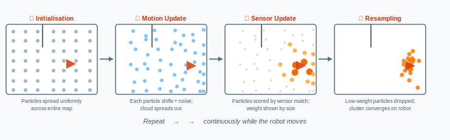

# Session 9 — AGV Technology & ROS Fundamentals

> **Duration:** 3 h · **Graded:** No

**Goal:** Students understand the technical building blocks that make autonomous navigation possible (sensors, localisation, path planning, SLAM) and can describe the ROS architecture using the correct vocabulary. The session ends with hands-on exposure to a live ROS environment.

---

## Agenda Overview

| Time | Phase | Format |
|---|---|---|
| 0:00 – 1:15 | Part 1: Autonomous AGV Technology | Lecturer presentation |
| 1:15 – 1:45 | Part 2: ROS — Architecture and Key Packages | Lecturer presentation |
| 1:45 – 2:00 | Part 3: Live Demo — TurtleBot3 Sensor Data in RViz | Lecturer hardware demo |
| 2:00 – 3:00 | Part 4: Guided Student Activity — First ROS Environment | Individual / pair work |

---

## Part 1 — Autonomous AGV Technology (75 min)

### 1.1 Sensors (15 min)

Why sensors matter: an AGV without reliable perception cannot navigate safely. Overview of the main sensor types used in autonomous systems:

| Sensor | Measured quantity | Typical use on AGV | Limitations |
|---|---|---|---|
| **LiDAR** (laser scanner) | Distance to obstacles, 360° point cloud | Obstacle detection, SLAM, localisation | Expensive; glass/mirrors cause artefacts |
| **Camera** | Visual image | Landmark recognition, AprilTags, visual SLAM | Sensitive to lighting; computationally expensive |
| **IMU** (inertial measurement unit) | Acceleration, angular velocity | Orientation estimation, dead reckoning correction | Drift over time |
| **Wheel encoders** | Wheel rotation count | Odometry (dead reckoning) | Slip leads to cumulative error |
| **Ultrasonic** | Distance (close range) | Safety/stop zone detection | Low resolution; slow update rate |

**Teaching note:** Show a photo of a real AGV with labelled sensors. Turtlebot3 Burger uses a 360° LiDAR (LDS-01) and wheel encoders — connect to the live demo later.

---

### 1.2 Dead Reckoning — Koppelnavigation (10 min)

**Idea:** Estimate current position purely from the starting point and movement data (wheel rotations, speed, direction). No external reference required.

**How it works:**
- Wheel encoders measure how far each wheel has turned
- From wheel rotations → calculate distance travelled and change in heading
- Accumulate these incremental steps to estimate the current pose (x, y, θ)

**Problem:** Every measurement has a small error. Errors accumulate with every step → the position estimate drifts further and further from reality over time. Dead reckoning alone is not sufficient for long-distance or high-accuracy navigation.

**Transition:** We need a way to correct the drift. This is where external references come in.

---

### 1.3 Landmark-Based Localisation — Peilen (10 min)

**Idea:** Use known features in the environment to correct the position estimate.

| Method | Landmark type | How it works |
|---|---|---|
| **Reflector targets** | Passive reflectors mounted at fixed positions | LiDAR detects reflectors and triangulates position |
| **AprilTags** | Printed fiducial markers (like QR codes) | Camera identifies tag ID and computes distance/angle |
| **Natural landmarks** | Distinctive corners, columns, structures | SLAM algorithms extract features without markers |
| **GPS** | Satellite signal | Works outdoors; unusable indoors |

---

#### AprilTags — Deep Dive (used in this course's lab)

AprilTags are a family of **visual fiducial markers** developed at the University of Michigan. They look similar to QR codes but are specifically designed for pose estimation by cameras in robotic systems.

**Structure of an AprilTag:**

An AprilTag consists of a black-and-white square pattern with a thick black border. The inner bit pattern encodes a unique integer ID. Different *tag families* (e.g. `tag36h11`, `tag25h9`) differ in bit count and error-correction properties — the `tag36h11` family is the standard choice for robotics applications because it offers a good balance of ID range, detection range, and false-positive resistance.

**How pose estimation works:**

When the camera detects a tag, the detection pipeline performs the following steps:

1. **Detection:** The image is scanned for quadrilateral shapes with a dark border. Candidate regions are decoded to extract the bit pattern and matched against the known tag library to confirm the ID.
2. **Corner extraction:** The four corners of the tag in the image are located with sub-pixel precision.
3. **Perspective-n-Point (PnP) solve:** Because the physical size of the tag is known (e.g. 0.16 m × 0.16 m in our lab setup), the camera's intrinsic parameters and the four corner positions in the image are sufficient to compute the full 6-DOF pose of the tag relative to the camera: translation (x, y, z) and rotation (roll, pitch, yaw).
4. **Coordinate transform:** The robot knows the camera's fixed position and orientation relative to its own body frame (the *camera extrinsics*). Using this, it transforms the tag pose into the robot's body frame, and from there into the world frame — using the tag's known world position from the map.

**What the robot ultimately gets:** Its own position and orientation in the map, accurate to a few centimetres at typical detection distances (0.3–3 m depending on tag size and camera resolution).

**Key properties relevant for the lab:**

| Property | Value / note |
|---|---|
| Tag family used | `tag36h11` |
| Typical physical tag size | 0.15–0.20 m side length (mounted on lab walls) |
| Detection range | ~0.3 m – ~2.5 m at lab resolution |
| Update rate | Depends on camera frame rate; typically 10–30 Hz |
| Lighting sensitivity | Requires adequate, even illumination; avoid strong backlighting |
| Occlusion | A partially covered tag cannot be detected — tags must have a clear line of sight |

**Why AprilTags instead of a pure SLAM approach in the lab?**

SLAM (Section 1.6) builds a map from scratch without any infrastructure. AprilTags require physical markers to be installed, but in return offer:
- Absolute position accuracy (no drift over time)
- Instant relocalisation after the robot is picked up or powered off
- Deterministic, easily debuggable detection output (you can see exactly which tag was seen)

In the lab, tags are mounted at known positions and heights around the workspace. The robot uses them as fixed reference points, analogous to GPS waypoints indoors.

**Teaching note:** Show a printed AprilTag. If possible, run the `apriltag_ros` detection node live on the lecturer laptop with a webcam: students can see the detected tag ID, the bounding box overlay, and the estimated distance/angle values in real time. This makes the abstract pose-estimation concept immediately tangible.

---

### 1.4 Probabilistic Localisation (15 min)

#### Why Probabilistic Approaches?

Sensors are never perfectly accurate. A LiDAR reading contains noise; wheel encoders slip; the environment changes. A system that maintains a single "best guess" position is fragile: one bad reading can knock it irretrievably off course, and the system has no way to express *how confident* it is.

**Probabilistic localisation** solves this by replacing the hard position estimate with a **probability distribution over all possible poses**. Instead of claiming "I am at (3.2 m, 1.7 m, 45°)", the robot maintains something closer to "I am most likely here, but I might also be over there — and I know exactly how likely each possibility is."

**Everyday analogy:** Imagine you are dropped blindfolded into a building you know the floor plan of. Your prior is that you could be anywhere. A friend then tells you: "You're near a window." Your belief narrows to all window positions. They add: "There's a pillar to your left." Your belief narrows further. After a few such hints you can pinpoint your location — even though every single hint was imprecise. This is the essence of Bayesian localisation.

---

#### The Two Building Blocks: Motion Model and Sensor Model

All probabilistic localisation methods — including AMCL — combine two complementary models:

| Model | Question answered | Input | Output |
|---|---|---|---|
| **Motion model** | Where did the robot move to? | Previous pose + odometry command | New pose distribution (wider — uncertainty grows) |
| **Sensor model** | How likely is this sensor reading if the robot were at pose *p*? | Candidate pose *p* + actual sensor data | A likelihood score (higher = more consistent) |

The motion model *spreads* the uncertainty (moving introduces new error); the sensor model *narrows* it by rewarding poses that are consistent with what the sensors actually measured. The interplay of these two models is what allows the system to stay localised over time.

---

#### AMCL — Adaptive Monte Carlo Localisation

AMCL represents the pose probability distribution as a **set of weighted particles**. Each particle is one hypothesis: a specific pose (x, y, θ) with an associated weight that reflects how plausible that pose is.

**Why particles?** A probability distribution over a continuous 2D map with orientation cannot be stored or computed exactly. Particles are a practical approximation: a large enough set of random samples can represent almost any distribution, including ones with multiple peaks (e.g. when the robot is in a symmetric corridor and cannot yet distinguish which end it is at).

---

**Step 1 — Initialisation**

If the starting position is unknown: particles are distributed uniformly across all free cells of the map with equal weight (1/N). Every location is equally likely.

If the starting position is roughly known (e.g. from a human operator placing the robot): particles are initialised in a Gaussian cloud centred on the known pose — dense at the centre, sparser towards the edges.

**Teaching note:** Show the RViz view at initialisation — a green fog covering the entire map. Students immediately grasp the "I don't know where I am" state.

---

**Step 2 — Motion Update (Prediction)**

When the robot moves (e.g. forward 0.5 m, turning 15°), each particle applies the same motion — but with **added noise** sampled from the motion model's uncertainty distribution.

*Example:* The robot commands "move forward 0.5 m". Particle A moves to (x+0.49, y+0.01, θ+0.3°). Particle B moves to (x+0.52, y−0.01, θ−0.1°). The exact displacement differs for each particle because real wheels slip and measurements are imperfect.

**Effect:** The particle cloud *spreads out* after each motion update. Uncertainty grows because movement accumulates error — exactly as described in Section 1.2 (dead reckoning drift).

---

**Step 3 — Sensor Update (Correction)**

The robot takes a LiDAR scan. For each particle, the system asks: *if the robot were actually at this particle's pose, what scan would it expect to see, given the known map?* The expected scan is compared to the actual scan, and the particle is assigned a **weight** (likelihood score).

- A particle in an open corridor where the real robot is in an open corridor → high weight (scan matches)
- A particle placed inside a wall → very low weight (the scan is completely inconsistent)

**Effect:** Particles in geometrically plausible positions receive high weights; particles in implausible positions receive near-zero weights.

---

**Step 4 — Resampling**

A new set of N particles is drawn from the current weighted set. Particles with **high weights are drawn multiple times** (survive and are duplicated); particles with **near-zero weights are rarely drawn** (effectively discarded). This is analogous to natural selection: well-adapted hypotheses multiply; poorly-adapted ones die out.

After resampling, all particle weights are reset to 1/N — the weights are now encoded implicitly in the *density* of the particle cloud (more particles = higher probability mass in that region).

**Effect:** The cloud converges towards the robot's true location. Repeat steps 2–4 continuously as the robot moves.

---

**Visualising the Full Cycle**

Each dot represents one particle (position hypothesis). Colour and size encode weight: orange/large = high plausibility, grey/small = low plausibility. After resampling, only the high-weight region survives and the cluster tightens around the robot's true location.

| Phase | Particle cloud appearance in RViz |
|---|---|
| Initialisation (unknown position) | Dense green fog across entire map |
| After first few motion updates | Fog begins to drift; slightly less uniform |
| After first sensor updates | Cloud starts to cluster at consistent locations |
| After several motion + sensor cycles | Tight cluster at true robot location |
| Steady-state navigation | Small, dense cluster moving with the robot |

**Teaching note:** An animation or sequence of four screenshots from RViz communicates this far better than equations. Walk through each phase live if a robot is available, or use the Gazebo simulation.

---

#### What Does "Adaptive" Mean in AMCL?

Standard Monte Carlo Localisation uses a fixed number of particles (e.g. always 500). AMCL is *adaptive*: it **adjusts the particle count dynamically** based on the current uncertainty.

- When the robot is **lost or newly initialised**: uncertainty is high → many particles needed → AMCL uses up to `max_particles` (e.g. 5,000).
- When the robot is **well localised**: uncertainty is low → few particles needed → AMCL reduces to `min_particles` (e.g. 100).

This makes AMCL computationally efficient: it does not waste processing power maintaining thousands of particles when the robot's position is already known precisely.

**Practical parameters in ROS (`amcl` package):**

| Parameter | Typical value | Effect |
|---|---|---|
| `min_particles` | 100 | Lower bound on particle count |
| `max_particles` | 5000 | Upper bound; used when localisation is uncertain |
| `update_min_d` | 0.2 m | Robot must move this far before a filter update is triggered |
| `update_min_a` | 0.5 rad | Or rotate this much before a filter update is triggered |

---

#### The Kidnapped Robot Problem

A known failure mode of localisation systems: the robot is physically picked up and moved to a new location without the system being notified (e.g. a forklift bumps it, or an operator repositions it). The particle cloud remains clustered at the old location — the robot "thinks" it is still there.

AMCL addresses this partially by keeping a small fraction of random particles scattered across the map at all times. If the robot is moved, these random particles suddenly score highly in the sensor update and the cloud eventually migrates to the new location. However, recovery can be slow. In practice, it is often faster for an operator to manually trigger a relocalisation (publishing an initial pose estimate in RViz).

**Teaching note:** This is a good discussion prompt — ask students "What could cause a robot to become lost in a real warehouse? How would you detect it?"

---

**Key intuition for students:** The robot is never *certain* about its position. It maintains a *distribution of beliefs*, updated continuously as it moves and perceives. The particle filter is a practical, scalable way to represent and compute that distribution without any assumptions about the shape of the uncertainty.

---

### 1.5 Path Planning (20 min)

**Context:** The robot knows where it is (localisation). It needs to decide *how to get* to a goal position. This is the job of the path planner.

Path planning in ROS is split into two separate layers that operate on different time horizons and at different scales:

| Layer | Role | Algorithm examples | Horizon |
|---|---|---|---|
| **Global planner** | Finds an optimal path through the full known map | Dijkstra, A* | Entire map; computed once per goal |
| **Local planner** | Executes the path in real time, reacting to dynamic obstacles | DWA (Dynamic Window Approach) | Small window around robot; re-computed at ~10 Hz |

---

#### Global Planner — Dijkstra Algorithm

The global planner treats the occupancy grid map as a **graph**: each free cell is a node, and edges connect neighbouring cells with a cost that reflects how desirable it is to pass through that area (cells near obstacles are assigned higher costs via the *costmap*).

**Dijkstra's algorithm** guarantees the shortest path in a graph with non-negative edge weights. It works as follows:

1. Assign cost **0** to the start node; assign **∞** to all other nodes.
2. From all unvisited nodes, select the one with the lowest current cost.
3. For each neighbour of that node: if the path *through* the current node is shorter than the neighbour's current cost, update it.
4. Mark the current node as visited (it will not be revisited).
5. Repeat from step 2 until the goal node is visited.
6. Trace the shortest path backwards from goal to start.

> **Worked example:** See the step-by-step Dijkstra example in the lecture slides (available on Moodle). The example walks through a small warehouse graph showing how the algorithm finds the shortest path between start and goal while correctly handling alternative routes with different edge weights.

**Key takeaway for students:** Dijkstra always finds the globally optimal path, but it explores the entire map (or large parts of it) to do so. For small maps this is fine; for large grids it can be slow.

---

#### Global Planner — A* as an Improvement

A* is a common alternative that uses a **heuristic** (typically the straight-line distance to the goal) to guide the search preferentially towards the goal. This reduces the number of nodes explored and speeds up planning considerably, while still guaranteeing the optimal path (provided the heuristic never overestimates the true cost).

**Comparison:**

| Property | Dijkstra | A* |
|---|---|---|
| Optimality | Always optimal | Optimal with admissible heuristic |
| Search direction | Uniform (expands in all directions) | Guided towards goal |
| Speed | Slower on large maps | Much faster in practice |
| ROS default | Used as fallback | Default in many ROS configurations |

**Teaching note:** The key intuition is that A* "knows roughly which direction the goal is" while Dijkstra "has no idea and checks everywhere equally."

---

#### Local Planner — Dynamic Window Approach (DWA)

Once the global planner has produced a path, the **local planner** is responsible for actually driving the robot along it. The local planner re-plans every 100 ms or so, using only the most recent sensor data within a small window around the robot.

**Why not just follow the global path exactly?**
The global map may be outdated — a person or forklift may have moved into the robot's path. The local planner handles these dynamic obstacles in real time.

**DWA works as follows:**

1. **Sample feasible velocities:** Generate a set of candidate velocity pairs (linear velocity *v*, angular velocity *ω*) that the robot can physically reach within one time step given its current speed and acceleration limits. This is the *dynamic window*.
2. **Simulate trajectories:** For each candidate velocity, simulate the robot's trajectory over a short horizon (e.g. 2–3 seconds).
3. **Score each trajectory** using a cost function that penalises:
   - Distance to obstacles (safety)
   - Deviation from the global path (staying on route)
   - Distance to the goal heading (progress)
4. **Select the best trajectory** (lowest cost) and send its velocity command to the drive controller.

**Teaching note:** Show the DWA visualisation in RViz (the fan of candidate trajectories in different colours). Students find this intuitive — the robot "tries out" possible futures and picks the best one.

---

#### Costmaps

Both planning layers use a **costmap** — a grid that annotates each cell of the map with a traversal cost:

| Cell type | Cost | Meaning |
|---|---|---|
| Free space, far from obstacles | 0 | Robot can pass without penalty |
| Inflated zone (near obstacle) | 1–252 | Path planner steers away to maintain clearance |
| Inscribed zone (inside robot footprint if centred here) | 253 | Robot body would touch obstacle — avoid |
| Lethal obstacle | 254 | Collision — strictly forbidden |

The *inflation radius* is a configurable parameter: a larger value produces more conservative, obstacle-shy paths; a smaller value allows the robot to pass closer to obstacles.

**Two separate costmaps in ROS:**
- **Global costmap** — built once from the static map; used by the global planner.
- **Local costmap** — updated continuously from live sensor data; used by the local planner for real-time obstacle avoidance.

---

**Connection to practice:** In ROS, the `move_base` node orchestrates both planners. When a goal pose is sent (via RViz or programmatically), `move_base` calls the global planner to compute a path, then hands execution over to the local planner, which continuously adjusts velocity commands until the goal is reached or the path is blocked.

---

### 1.6 SLAM — Simultaneous Localisation and Mapping (5 min)

**The chicken-and-egg problem of autonomous navigation:**
- To localise, the robot needs a map.
- To build a map, the robot needs to know where it is.

**SLAM solves both at the same time** while the robot drives through an unknown environment.

**Output:** An *occupancy grid map* — a 2D grid where each cell is marked as free, occupied, or unknown. This map is then used by the navigation stack for path planning.

**ROS implementations:** `gmapping` (particle-filter based, established), `cartographer` (graph-based, more accurate). In this course we use `gmapping` with TurtleBot3.

---

## Part 2 — ROS: Architecture and Key Packages (30 min)

### 2.1 Why ROS? (5 min)

Without ROS, each robotics project would re-implement the same low-level components (sensor drivers, communication, coordinate transforms) from scratch. ROS provides:

- **Hardware abstraction:** swap a sensor without rewriting the application code
- **Modularity:** each capability runs as an independent process (node)
- **Reusability:** thousands of open-source packages for navigation, vision, manipulation
- **Community:** de-facto standard in research and increasingly in industry

### 2.2 Core Architecture (15 min)

| Concept | What it is | Analogy |
|---|---|---|
| **Node** | An independent process that does one job | A department in a company |
| **Topic** | A named data channel; nodes publish or subscribe | A radio frequency |
| **Message** | The data type carried on a topic (e.g. `sensor_msgs/LaserScan`) | The format of a broadcast |
| **Service** | Synchronous request–response call between nodes | A phone call (you wait for the answer) |
| **Action** | Like a service, but for long-running tasks with feedback | A project with status updates |
| **Parameter server** | Stores configuration values accessible to all nodes | A shared config file |

**Example for TurtleBot3:**
- `/scan` topic: LiDAR node publishes laser scan data → SLAM node subscribes
- `/cmd_vel` topic: teleop node publishes velocity commands → drive controller subscribes
- `/odom` topic: wheel encoder node publishes odometry → navigation stack subscribes

### 2.3 Key Packages and Tools (10 min)

| Package / Tool | Role in this course |
|---|---|
| **Gazebo** | 3D physics simulator — runs the virtual TurtleBot3 |
| **RViz** | Visualises sensor data, the particle cloud, the map, and the planned path |
| **Navigation Stack** | Integrates AMCL, `move_base`, costmaps into autonomous navigation |
| **gmapping** | SLAM: builds the occupancy grid map from LiDAR data |
| **teleop\_twist\_keyboard** | Keyboard-controlled teleoperation — sends `/cmd_vel` commands |
| **rqt\_graph** | Shows the node–topic graph of the running ROS system |
| **rostopic echo** | Prints live messages on any topic to the terminal |

---

## Part 3 — Live Demo: TurtleBot3 Sensor Data in RViz (15 min)

**Hardware:** Real TurtleBot3 (Burger or Waffle Pi), connected to lecturer laptop via Wi-Fi.

**Demo steps:**

1. Launch TurtleBot3 bringup on the robot and the visualisation on the laptop
2. Open RViz — show the LiDAR point cloud rotating in real time
3. Open a terminal, run `rostopic echo /scan` — show raw distance data scrolling
4. Run `rqt_graph` — show the live node–topic graph
5. Drive the robot manually (`teleop_twist_keyboard`) — show `/cmd_vel` messages and how they reach the motor controller node
6. Point out: all of this is exactly what students will see in the Gazebo simulation next

---

## Part 4 — Guided Student Activity: First ROS Environment (60 min)

**Setup:** Pre-configured VMs with ROS Noetic + TurtleBot3 simulation packages installed.

**Activity sheet:** `assignments/ros-fundamentals.md` (→ AP5)

**Steps students follow:**

1. Launch the TurtleBot3 Gazebo simulation using the provided command (`roslaunch turtlebot3_gazebo turtlebot3_world.launch`)
2. Open a second terminal; launch RViz to visualise the simulation
3. Run `rqt_graph` — sketch the node–topic graph in the activity sheet
4. Run `rostopic list` — note all active topics
5. Run `rostopic echo /scan` for 10 seconds — note the structure and value range of the laser data
6. Run `rostopic echo /odom` — compare the structure to the LiDAR data
7. Answer reflection questions in the activity sheet:
   - Which node publishes `/scan`? Which subscribes?
   - What would happen if the LiDAR node crashed?
   - Name two topics you would need to monitor to understand if the robot is moving

**Deliverable:** None (ungraded). Completed activity sheet is kept as reference for Session 10.

---

## Files

| File | Description | Status |
|---|---|---|
| `assignments/ros-fundamentals.md` | Guided activity sheet for students | ⏳ To do (AP5) |
| `scripts/` | Launch file wrappers and README for VM setup | ⏳ To do (AP5) |

---

## Preparation Checklist (Lecturer)

- [ ] TurtleBot3 (real) charged and tested — bringup runs without errors
- [ ] Lecturer laptop: ROS installed, TurtleBot3 packages, RViz profile saved
- [ ] Student VMs: ROS Noetic + TurtleBot3 simulation packages pre-installed and tested
- [ ] Gazebo simulation launches within acceptable time on VM hardware
- [ ] Dijkstra worked example prepared and integrated into slides
- [ ] Slides for Parts 1 and 2 ready (distribute via Moodle)

---

## Open Development Tasks

- [ ] **AP5:** Write `assignments/ros-fundamentals.md` (activity sheet for Part 4)
- [ ] **AP5:** Prepare launch file wrappers and VM setup README in `scripts/`
- [ ] **VM performance:** Verify Gazebo runs at acceptable speed on lab VM specs (→ `docs/semester-prep.md`)

---

*Lecturer reference only.*
